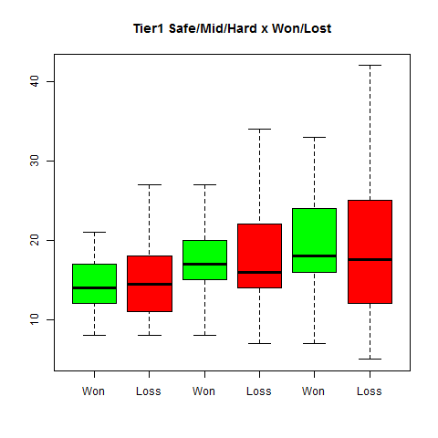
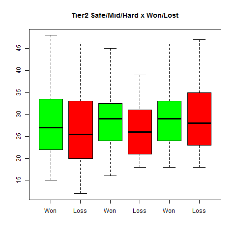
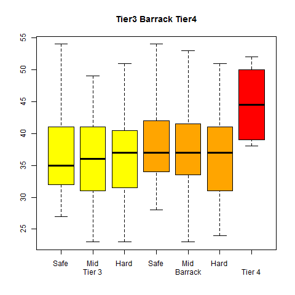

On our way to DotA's analysis, we deliver here some preliminary results
on the pulse of DotA.

We are only interested in high level DotA, namely here The International
5 (TI5).

We analyzed:

-   a corpus of 48 games of the final stage
-   we considered the time (in minutes) where each objective (tower,
    barracks) falls
-   strategic semantic were applied:
    1.  for each team, there are three lanes: safe, mid, hard
    2.  and 4 tiers: tier1, tier2, tier3 for the tower on the lanes,
        tier4 for those protecting the throne.
    3.  independently of the team, an objective was considered regarding
        the difficulty of its lane. For example, top Radiant tower
        (hard) is equivallent to Dire's bottom (and *vice-versa*)
    4.  an objective was attributed to the \\"won\\" (resp. \\"loss\\")
        category if it felt because of the winner (resp. loser) of the
        game
    5.  due to the lack of data, we may have only consider the
        objectives taken by the winner.

    

For easy reading, we give below the boxplots of the distribution, tier
by tier. They allow to quickly estimate the mean and the dispersion of
the values. Further statistical tests should be assessed, but
interesting comments appeared.

## First line of towers (tier1)

The figure below represents the boxplot of the \\"time-to-fall\\" of the
Tier1 towers, in green when they were taken by the winner (red for the
loser).

Let's observe that:

-   for the winner, the first tower to be taken is the safe tower of the
    losers: teams first try to open the space and drastically reduce the
    control map.
-   for the loser, the rhythm can be quicker than the winners' one. This
    tendency will be confirmed for the next tier.

## Second line of towers (Tier2)

The previously exhibited tendency is confirmed below:

-   safe lane stays the favorite target
-   loser teams tend to take the objectives earlier that the winner
    ones.

Would there exist any reasonable rythm for DotA ? Yes: not too slow, not
too fast.

## Attack of the base

The below boxplots give only information about the winner team.  
Nothing really surprising, just remind the order : safe, mid, hard.

## Conclusion

We only delivered here an univariate rough analysis of the times where
objectives fall in DotA. It is just a way to our main goal, witch
addresses the dynamic of the confrontation. But it already gives more
insight about how to grasp the pulse of DotA.

## Who are we?

Fran?ois Rioult, Nicolas Calenge, Mehdi Kaytoue.
