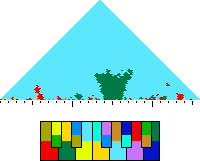

---
author:
- François Rioult
lang: fr
title: Visualisation de la tonalité
---

# Visualisation de la tonalité

Ce travail consiste à proposer une visualisation dynamique de la tonalité au cours d'une séquence musicale.

1. chaque partition est arrangée en *quatuor*, depuis l'original
2. puis exportée au format `MusicXML`
3. l'[application  `Verovio`](https://editor.verovio.org/) convertit le format `MusicXML` en `MEI`, une autre version XML (que l'on peut obtenir par [transformation XSLT](https://github.com/music-encoding/encoding-tools)
4. la [librairie `Humdrum Extras`](https://extras.humdrum.org) convertit le format `MusicXML` en `hum` et effectue l'analyse des tonalités.
5. j'assemble le tout en JSON après divers traitements pour générer la visualisation

## Calcul de la tonalité

Les données sur l'harmonie sont fournies par l'utilitaire [`mkeyscape`](https://extras.humdrum.org/man/mkeyscape/) qui définit un *pas d'analyse*, ici à la *croche*. Par exemple, sur les 26 mesures à 4 temps du Bach BWV555 de référence, `mkeyscape` calcule, pour 26 * 4 = 104 points, la tonalité :

* pour calculer la tonalité, `mkeyscape` soumet les notes exprimées au point de mesure à l'algorithme de Krumhansl-Schmuckler, qui établit une corrélation de Pearson entre l'histogramme mesuré des classes de hauteur et les profils prédéterminés pour les tonalités majeures et mineures.
* à la granularité de la croche, les données obtenues sont assez cahotiques. On souhaite cependant un peu de stabilité et `mkeyscape` fournit une analyse sur toutes les nombres de points inférieurs à la valeur demandée :
  * pour 104 points, on obtient des valeurs qui varient à *chaque* point
  * pour 103 points, la mesure est beaucoup plus stable. C'est la valeur choisie pour la visualisation.
  * pour 1 point, on obtient la tonalité *globale* du morceau.

`mkeyscape` produit suffisamment d'analyses pour les représenter par un triangle, chaque ligne représente une finesse d'analyse variable.

## Visualisation d'une tonalité

Les couleurs sont inspirées par la synesthésie de ma fille. *Majeur et relatif mineur* sont confondus.

Pour les tonalités majeures, la fondamentale et la quinte sont situées sur le cercle extérieur, et liées à la tierce mineure sur le cercle intérieur. Pour les tonalités mineures, c'est le contraire.

Cette technique de visualisation dispose les tonalités autour d'un cercle de manière à ce que leur proximité géométrique reflète la proximité harmonique.