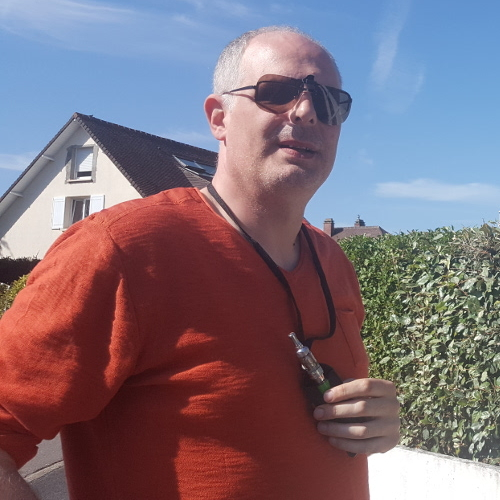
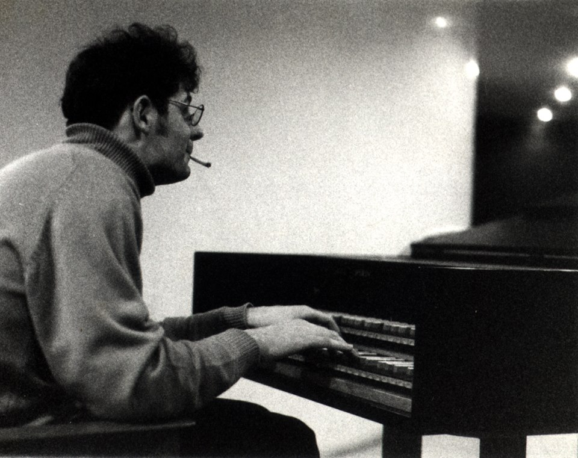

## François Rioult

[GREYC](https://www.greyc.fr/equipes/codag/) - CNRS UMR 6072  
[Université de Caen Normandie](http://www.unicaen.fr)  
[UFR Sciences](http://ufrsciences.unicaen.fr/) - Département
mathématique - informatique

Campus Côte de Nacre, F-14032 Caen cedex, France  
Tel: +33 (0)2.31.56.73.79 - Fax: +33 (0)2.31.56.73.30  
Office: Sciences 3 - 353  
email:
[Francois.Rioult@unicaen.fr](mailto:Francois.Rioult@info.unicaen.fr)

In 2020 I was 53 years old. Between 1990 and 2000, I was sound-engineer
for french television, cinema and music bands.

I defended in 2005 my PhD in computer science. I am now associate professor in Caen (France): researcher for the Normandie Univ, UNICAEN,
ENSICAEN, CNRS, GREYC and teacher in the University of Caen Basse-Normandie. In 2017, I defended my HDR (accreditation to supervise research or
habilitation thesis).

### Research interests

-   Data mining and Knowledge Discovery in Databases
-   Missing values in databases
-   Algorithmical aspects of data mining - condensed representations
-   Machine learning, classification, clustering
-   (e-)Sport analysis

See my [publications](biblio.md).

### Miscellaneous

-   [Some aphorims (in French)](aphorims.md)

### Music

Music is an important part of my life.

You can find some of mine at Souncloud:
[https://soundcloud.com/user-578993177](https://soundcloud.com/user-578993177)
