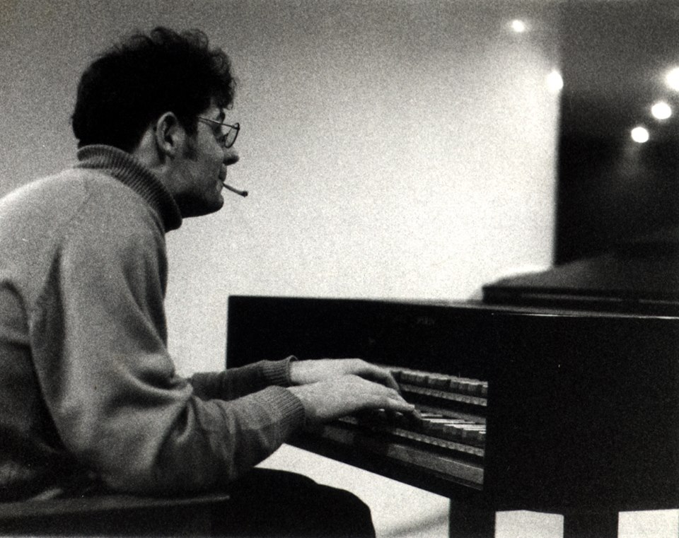

## François Rioult

[Normandie Univ, UNICAEN, ENSICAEN, CNRS, GREYC](https://www.greyc.fr/equipes/codag/)  
[Université de Caen Normandie](http://www.unicaen.fr)  
[UFR Sciences](http://ufrsciences.unicaen.fr/) - Département
mathématique - informatique

Campus Côte de Nacre, F-14032 Caen cedex, France  
Tel: +33 (0)2.31.56.73.79 - Fax: +33 (0)2.31.56.73.30  
Office: Sciences 3 - 353  
email:
[Francois.Rioult@unicaen.fr](mailto:Francois.Rioult@info.unicaen.fr)

In 2020 I was 53 years old. Currently Associate Professor in Computer Science at Normandie Univ (UNICAEN, ENSICAEN, CNRS), member of GREYC (UMR 6072), Caen, France. Habilitation (HDR) obtained in 2017. Initial career as a sound engineer (1990–2000) for television, cinema and music.

My research sits  at the intersection of formal modelling, combinatorial optimisation and algorithm design. Main themes include discrete structures for knowledge extraction (Boolean matrix factorisation, formal concept analysis, hypergraphs), machine learning for complex dynamic systems through geometric and graph-based models, and predictive modelling of heterogeneous temporal data in decision-making contexts, such as sport and competitive games, e-sport.

Intellectual breadth combined with methodological discipline characterises the trajectory — sustained curiosity with a healthy skepticism toward narrow disciplinary silos.

### Research interests

- Data mining
- Boolean matrix factorization
- Optimization and ILP
- Machine learning for dynamic systems
- Graph-based modeling
- Sports analytics
- Temporal data analysis
- Web content extraction
- LLM applications

See my [publications](biblio.md).

### D3.js samples

-   [Filtrage successif d'un nuage de tags](https://rioultf.users.greyc.fr/d3/bubble/bubble.html)
-   [Visualisation de trajectoires dans DotA2](https://rioultf.users.greyc.fr/d3/polygon/index.php)
-   [Petit site de visualisation de données bibliographiques](https://rioultf.users.greyc.fr/d3/framework)
    (Merci à Marc Plantevit)

### Miscellaneous

-   [Some aphorims (in French)](aphorims.md)
-   [DotA Pulse](dota_pulse.md)

### Music

Music is an important part of my life.

See my work about [Tonality Visualization](hurmony/index.md).

You can find some of mine at Souncloud:
[https://soundcloud.com/user-578993177](https://soundcloud.com/user-578993177)
