---
author:
- François Rioult
lang: fr
title: Application des LLM
subtitle: Fonctionnement d'un modèle de langue
---

# Architecture

Les LLM fonctionnent grâce à des réseaux de neurones récurrents, qui ont *appris* à prédire le prochain jeton selon les jetons qu'il a lus précédemment. 

C'est le même fonctionnement que votre application de rédaction de MMS qui vous propose des mots probables selon les mots précédents dans votre message en cours d'écriture. 

<!---------------------------------------------------------------->
## Apprentissage par réseau récurrent de neurones

Un réseau de neurones est une structure informatique qui apprend à mettre en relation une *entrée* et une *sortie*. On fournit au réseau des paires $(entree, sortie)$ pour lesquelles il doit déterminer une relation *fonctionnelle*.

Entrée comme sortie peuvent être quasiment n'importe quel type de donnée : numérique, texte, image, vidéo, etc. Tout finira par être transformé en vecteurs de nombre, par une opération d'*embedding* (intégration en français).

### Neurone 

Un *neurone* est un objet informatique, qui possède :

* une valeur (généralement entre -1 et 1)
* des connexions *entrantes* pondérées avec d'autres neurones : un ensemble de poids $w_i$ tels que $h_i = \sum_j w_j h_j$
* des connexions *sortantes* avec d'autres neurones

Un neurone reçoit des informations, à sa manière, et transmet une information.

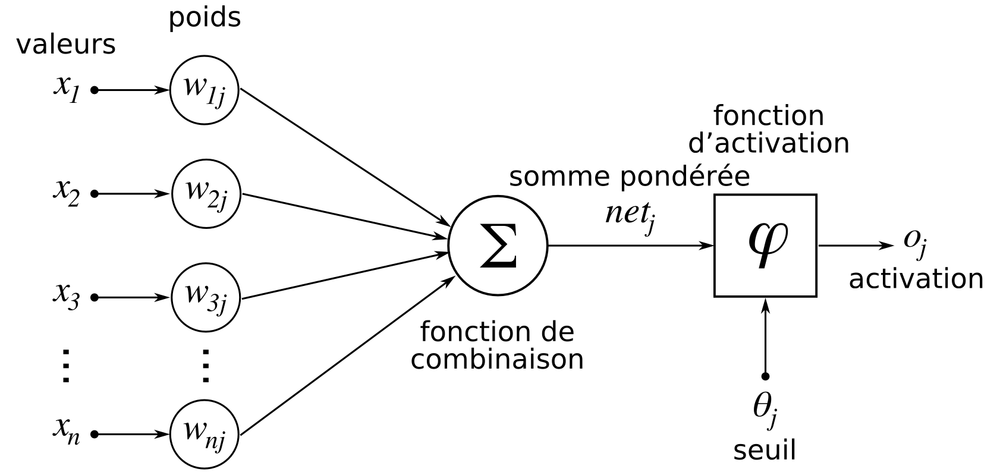

### Réseau de neurones

Un réseau de neurones structure la transformation\ :

* de l'entrée : multi-dimensionnelle, donne initie le réseau par autant de neurones que de dimensions
* en la sortie (multi-dimensionnelle, autant de neurones que de dimension) 
* en intercalant des couches de neurones

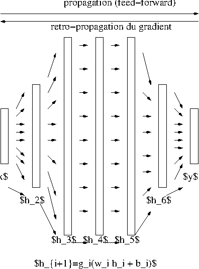 

### Redescription de l'espace

Il faut voir une couche de neurones comme étant une *projection* de son entrée vers un espace de redescription où la *similarité* entre les objets étudiés sera plus *discriminante* que celle de l'espace initial.

La notion de discrimination est définie ici par le contexte d'appariement fourni au cours de l'apprentissage. 

### Entraînement d'un réseau de neurones

La tâche d'entraînement d'un réseau de neurones, appelée *apprentissage*, consiste sur un réseau *vierge* à présenter un exemple d'entrée et de mesurer la sortie obtenue. Cette sortie est comparée à la *sortie attendue* ou *vérité*, selon une mesure de *perte* définie, qui sert d'indication au réseau pour être modifié.

La modification des poids du réseau procède par *rétro-propagation de gradient*. Le *gradient* est le mot physique pour *variation*. De la sortie à l'entrée, on propage la variation entre la sortie obtenue et la vérité - dans la pratique, on fait des groupes d'instances (*batch*) et on rétro-propage la moyenne.

### Réseau de neurones récurrent

Lorsque les données sont de nature *séquentielle*, c'est-à-dire concerne une évolution temporelle ou spatiale, il faut un réseau capable de traiter des entrées séquentielles\ : un réseau de neurones récurrent. Les applications sont nombreuses : texte, vidéo, audio, trajectoires.

Un réseau récurrent est constitué de *cellules* égrénant le temps, reliées aux autres cellules par des mécanismes d'*attention*. La largeur de la fenêtre d'attention définit la taille du *contexte*.

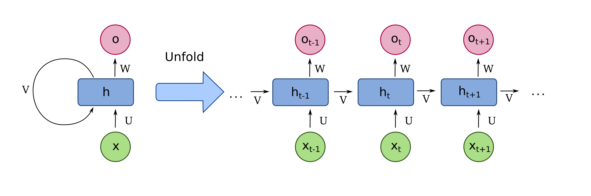


<!---------------------------------------------------------------->
## Mécanisme de l'attention

Voici une **version nettement resserrée (≈ 1–2 pages)**, **cohérente**, **sans redondance**, qui conserve **le formalisme mathématique essentiel**, et où **chaque équation est immédiatement illustrée par un schéma Mermaid**.
Le texte est prêt à être intégré tel quel dans ton cours.

---

# Mécanisme de l’attention

Dans un LLM, l’attention **ne produit pas la décision finale**.
Elle détermine **quelles informations du contexte doivent être prises en compte** pour la produire.

La prise de décision correspond ici à :

> **la prédiction du token suivant**.

L’attention intervient **en amont** de cette prédiction : elle construit, pour chaque position, une **représentation contextuelle pertinente**, utilisée ensuite par la couche de prédiction (logits → softmax).

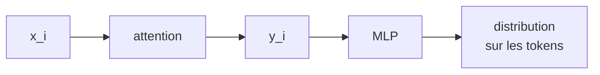

---

## Pondération locale du contexte

Le mécanisme d’attention remplace un **résumé global unique** par un **mécanisme de pondération locale** :

> pour chaque position ( i ), le modèle décide **quelles autres positions ( j )** sont pertinentes, et **à quel degré**.

Formellement, pour chaque entrée ( x_i ), la sortie associée est :

[
y_i = \sum_j w_{ij} , x_j
]

Cette formule est simple en apparence, mais **chaque entrée ( x ) y joue plusieurs rôles distincts**.

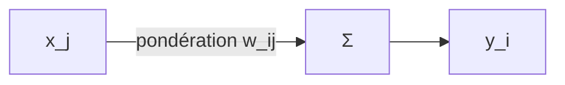

---

## Décomposition fondamentale : query, key, value

Dans la somme
[
y_i = \sum_j w_{ij} , x_j
]

chaque entrée intervient de trois façons différentes :

1. **dans la similarité** (construction de ( w_{ij} )),
2. **dans les poids** (normalisation),
3. **dans la combinaison finale** (information agrégée).

Ces rôles correspondent aux notions de **query**, **key** et **value**.

---

## Query — définir le critère de recherche

Pour produire ( y_i ), l’entrée ( x_i ) est projetée en une requête :

[
q_i = W_q x_i
]

Le vecteur **query** encode un **critère de similarité appris**.

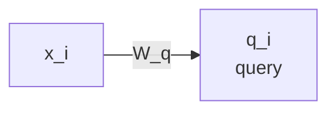

> Interprétation :
> *« Quelles autres représentations sont pertinentes selon ce critère ? »*

---

## Key — mesurer la pertinence

Chaque entrée ( x_j ) est également projetée en clé :

[
k_j = W_k x_j
]

Les **keys** servent à mesurer la pertinence vis-à-vis de la query.

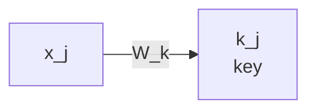

La similarité entre ( i ) et ( j ) est donnée par :

[
w'_{ij} = q_i^T k_j
]

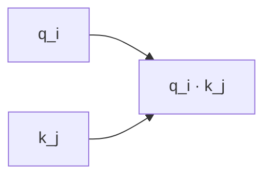

---

## Normalisation : pondérer le contexte

Les scores sont transformés en poids par une normalisation softmax :

[
w_{ij} = \frac{e^{w'*{ij}}}{\sum_j e^{w'*{ij}}}
]

Propriétés :

* ( w_{ij} \in [0,1] )
* ( \sum_j w_{ij} = 1 )

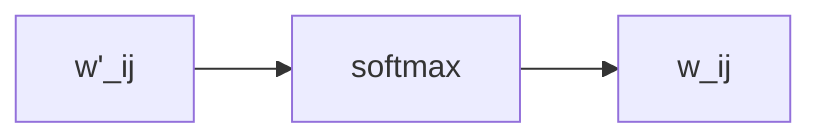

Ces poids indiquent **l’attention que la position ( i ) accorde à ( j )**.

---

## Value — information agrégée

Enfin, chaque entrée ( x_j ) est projetée en valeur :

[
v_j = W_v x_j
]

Les **values** sont les **contenus effectivement combinés**.

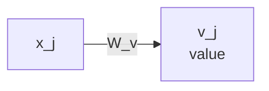

La sortie finale est alors :

[
y_i = \sum_j w_{ij} , v_j
]


> **Lecture clé** :
> les **keys** décident *où regarder*,
> les **values** décident *quoi récupérer*.

---

## Schéma global (une position ( i ))

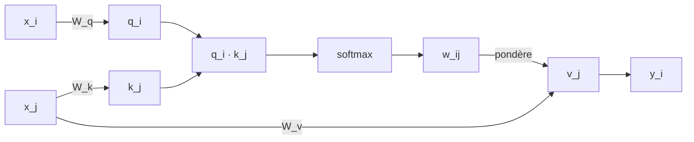

---

## Point conceptuel essentiel

> Une même entrée ( x ) n’a pas un rôle unique.
> Elle est vue simultanément comme :
>
> * un **critère de recherche** (query),
> * un **indice de pertinence** (key),
> * un **contenu informationnel** (value).

Ces trois rôles sont **distincts**, **appris**, et **optimisés indépendamment**.

---

## À retenir (formulation finale)

> L’attention permet à chaque token de **définir un critère de similarité**,
> d’**évaluer toutes les autres positions selon ce critère**,
> puis de **combiner les informations pertinentes** pour construire une représentation contextuelle adaptée à la décision.

Si tu veux ensuite, je peux :

* condenser encore en **une seule slide**,
* préparer la **transition vers le multi-head attention**,
* ou aligner la notation avec une **écriture matricielle Transformer**.

<!---------------------------------------------------------------->
## Définition d'un LLM


Un LLM (ou *large language model*) est un modèle de langue constitué par un réseau de neurones récurrent entraîné à prédire des tokens de texte à partir d'un contexte de tokens, sur des *corpus* de textes proportionnels à sa *taille*.

La façon de *tokenizer* le texte est importante. Cette fonctionnalité peut elle-même être fournie par un LLM.

Aspect important dans les transformers : [connexion residuelle](https://arxiv.org/abs/1512.03385)

query : ce que je cherche
key : ce que je transmets
value : mon information interne


<!---------------------------------------------------------------->
# Constituants informatiques

## Dataset

Il s'agit du corpus de textes qui a servi à entraîner le RNN. Ce peut être du texte brut, des pages web, des appariements question-réponse (*question/answer* Q/A en anglais).

Les dataset peuvent également être spécialisés dans des domaines, par exemple la médecine, de code, la recherche...

## Modèle

Le modèle, c'est-à-dire le RNN, est précisé par sa *structure* sous forme de tenseurs et ses *poids*. Il est généralement conçu pour être exécuté sur une carte graphique, programmée dans le langage CUDA. Des librairies de plus haut niveau (Tensorflow, Torch, Keras) sont disponibles en python.

* [vade mecum sur la conception d'un llm](https://symbl.ai/developers/blog/a-guide-to-building-an-llm-from-scratch/)
* [GPT from scratch - code - architecture détaillée](https://jaketae.github.io/study/gpt/)

## Évaluation - benchmark

Un LLM peut être confronté à des benchmarks, qui sont des paires Q/A.

* [test sans contamination des meilleurs modèles](https://livebench.ai/#/)

<!---------------------------------------------------------------->
# Constituants opérationnels

## API

Une part importante de l'écosystème consiste en la fourniture de ressources de calcul pour faire tourner les LLM. On dispose d'*endpoint* (point d'accès) interrogeables par une API.

## Chat template

Un chat alterne des tours de parole entre les différents *rôles* : `user`, `assistant`, `system`. C'est un échange de messages, qui démarrent par le token `<|im_start|>`, introduisent le rôle de l'émetteur puis le *contenu* du message, et terminent par le token `<|im_end|>`.

Le chat est paramétré par le *chat template*, qui indique au modèle comment il doit se comporter. C'est quasiment du code, en tout cas un langage proche de [`twig`](https://twig.symfony.com/). Par exemple, le template pour `HuggingFaceTB/SmolLM2-360M-Instruct` (cf. clé `chat_template` dans `tokenizer_config.json`) :

```twig

  
    {{ '<|im_start|>system\nYou are a helpful AI assistant named SmolLM, trained by Hugging Face<|im_end|>\n' }}
  
  {{'<|im_start|>' + message['role'] + '\n' + message['content'] + '<|im_end|>' + '\n'}}


  {{ '<|im_start|>assistant\n' }}

```

* [chat template](https://huggingface.co/docs/transformers/main/en/chat_templating)


## Comment le modèle s'arrête-til de produire des jetons ?

Le modèle a été entraîné sur des textes terminant par le token EOS `<|endoftext|>`.

* [Comment le LLM sait quand s'arrêter de générer](https://www.louisbouchard.ai/how-llms-know-when-to-stop/)
* [Discussion sur ce qui le fait s'arrêter](https://www.reddit.com/r/LocalLLaMA/comments/1haizeq/llm_noob_here_can_any_explain_whats_happening/)

## System prompt

* [Obtenir le system prompt d'un LLM](https://www.reddit.com/r/ChatGPTPromptGenius/comments/1h2uxeh/full_starting_prompt_for_chatgpt/)
* [systeme prompt de chatgpt](https://www.reddit.com/r/ChatGPT/comments/1h94hz8/accidentally_discovered_a_prompt_which_gave_me/)
* [meta promt d'openai](https://platform.openai.com/docs/guides/prompt-generation)
* <https://www.reddit.com/r/ChatGPTCoding/comments/1hkudnz/openai_reveals_its_prompt_engineering/>

### Transformer

* [Illustration animée de l'ensemble des étapes](https://bbycroft.net/llm)
* [Transformers par 3Blue1Brown](https://www.youtube.com/watch?v=wjZofJX0v4M)
* [Attention par 3Blue1Brown](https://www.youtube.com/watch?v=eMlx5fFNoYc&list=PLZHQObOWTQDNU6R1_67000Dx_ZCJB-3pi&index=8)
* [transformer explained](https://poloclub.github.io/transformer-explainer/)
* [Transformer illustré](http://jalammar.github.io/illustrated-transformer/)
* [Transformers + architecture + code](https://jaketae.github.io/study/transformer/)
* [Spécifique attention](https://jaketae.github.io/study/seq2seq-attention/)
* [Les explications les plus précises](<https://www.youtube.com/watch?v=kCc8FmEb1nY>)
* [Framework mathématique - Anthropic - animation de l'attention sur texte](https://transformer-circuits.pub/2021/framework/index.html)
