## Mécanisme de l’attention

Historiquement, l’alignement de séquences d’items requiert l’insertion d’un encodeur/décodeur de *contexte*.

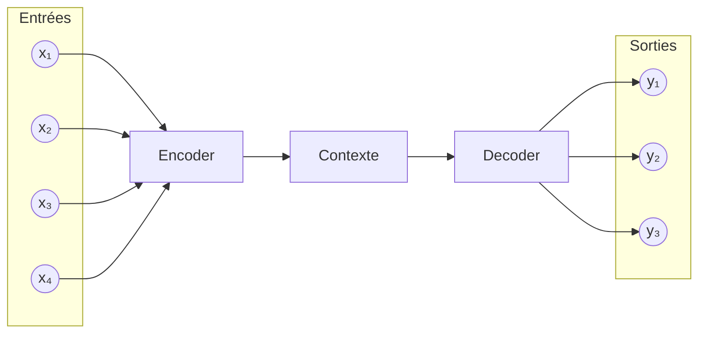

### Seq2Seq

On considère une *séquence d’entrée* $(x\_1, x\_2, \dots, x\_T)$

et une *séquence de sortie* :

$$(y\_1, y\_2, \dots, y\_{T'})$$
lllll
**The Cauchy-Schwarz Inequality**\
$$\left( \sum_{k=1}^n a_k b_k \right)^2 \leq \left( \sum_{k=1}^n a_k^2 \right) \left( \sum_{k=1}^n b_k^2 \right)$$


#### 1. Encodeur : construction du contexte global

L’encodeur traite la séquence d’entrée pas à pas :

[ h\_t = f\_{\text{enc}}(x\_t, h\_{t-1}) \qquad t = 1, \dots, T ]

```mermaid
flowchart LR
    xt[x_t] --> f[f_enc]
    hprev[h_{t-1}] --> f
    f --> ht[h_t]
```

Le *contexte global unique* est alors défini comme :

[ c = h\_T ]

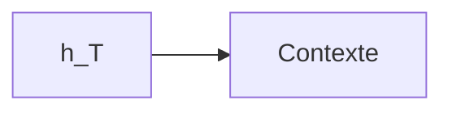

Toute l’information de la séquence d’entrée est *compressée* dans ce vecteur.

---

#### 2. Décodeur : génération conditionnée par le contexte

Le décodeur est initialisé par le contexte :

[ s\_0 = c ]

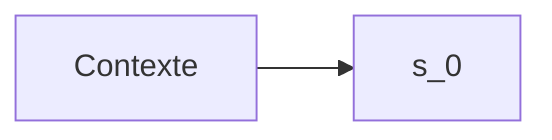

Puis, à chaque pas de temps, il génère un état interne :

[ s\_t = f\_{\text{dec}}(y\_{t-1}, s\_{t-1}) \qquad t = 1, \dots, T' ]

```mermaid
flowchart LR
    yprev[y_{t-1}] --> fdec[f_dec]
    sprev[s_{t-1}] --> fdec
    fdec --> st[s_t]
```

La probabilité du token de sortie est donnée par :

[ P(y\_t \mid y\_{\<t}, x\_{1\:T}) = \mathrm{softmax}(W\_o s\_t) ]

```mermaid
flowchart LR
    st[s_t] --> Wo[W_o]
    Wo --> soft[softmax]
    soft --> pt[P(y_t)]
```

---

#### 3. Résumé fonctionnel

[ \boxed{ \begin{aligned} c &= \mathrm{Encoder}(x\_1, \dots, x\_T) \ y\_t &= \mathrm{Decoder}(y\_{\<t}, c) \end{aligned} } ]

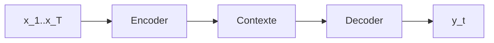

---

### Transition vers l’attention

Dans un modèle avec attention, le contexte devient *dépendant de ( t )* :

[ c \longrightarrow c\_t = \sum\_j \alpha\_{tj} h\_j ]

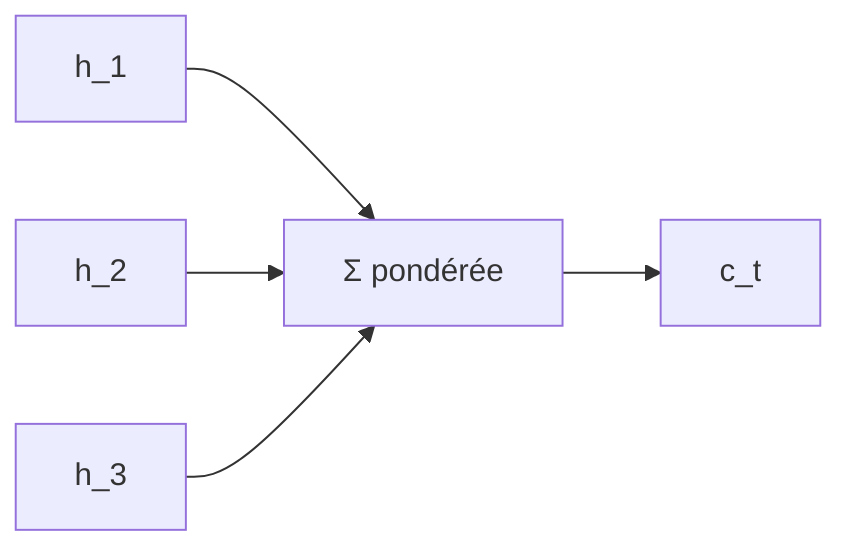

Chaque sortie reconstruit ainsi son propre contexte.

---

## Pondération locale du contexte

Le mécanisme d’attention remplace un *résumé global unique* par un *mécanisme de pondération locale*.

Formellement, pour chaque entrée ( x\_i ), la sortie associée est :

[ y\_i = \sum\_j w\_{ij} x\_j ]

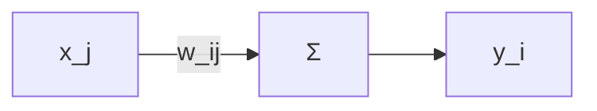

---

## Décomposition : query, key, value

Pour produire ( y\_i ), l’entrée ( x\_i ) est projetée en requête :

[ q\_i = W\_q x\_i ]

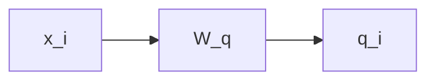

Chaque entrée ( x\_j ) est projetée en clé :

[ k\_j = W\_k x\_j ]

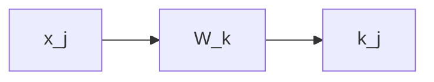

La similarité est donnée par :

[ w'\_{ij} = q\_i^T k\_j ]

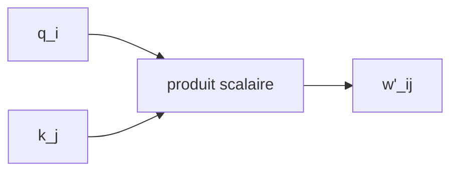

La normalisation softmax définit les poids :

[ w\_{ij} = \frac{e^{w'*{ij}}}{\sum\_j e^{w'*{ij}}} ]

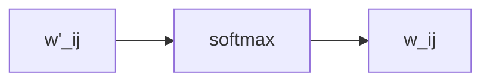

Les valeurs sont projetées par :

[ v\_j = W\_v x\_j ]

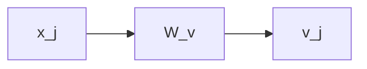

La sortie finale est :

[ y\_i = \sum\_j w\_{ij} v\_j ]

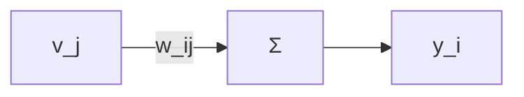

---

## À retenir

L’attention permet à chaque token de *définir un critère de similarité*, d’évaluer toutes les autres positions selon ce critère, puis de *combiner les informations pertinentes* pour construire une représentation contextuelle adaptée à la décision.

