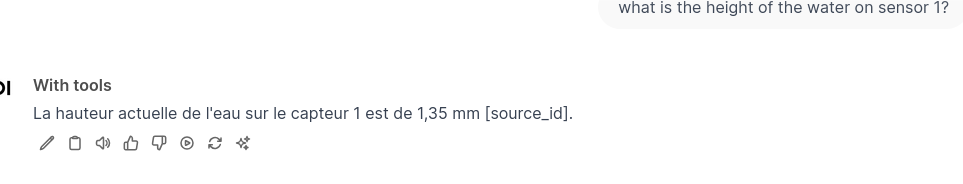

---
author:
- François Rioult
lang: fr
title: Application des LLM
subtitle: Introduction
---

Ce document synthétise mes déboires et succès dans l'exécution d'*outils* avec `OWUI` (a.k.a [Open-webui](https://docs.openwebui.com/)).

# Introduction

`Open-webui` fait tourner un serveur local et rend disponible une interface web pour concevoir des *applications* à base de LLM. C'est un outil libre et open-source, développé par une seule personne, pourtant la qualité est extraordinaire :

* l'interface pour la mise au point des prompts est la plus complète que j'aie vue : les interactions sont stockées dans un arbre ; c'est un *historique arborescent*
* tout ce qui est nécessaire au RAG et la compétition de modèles est intégré
* des *filtres*, qui modifient le prompt et la réponse
* des *actions*, qui ajoutent des fonctionnalités à l'interface de saisie du prompt : en plus des traditionnels copy/vote, on peut déclencher du code, qui interprète la réponse du modèle pour e.g. générer des graphiques
* des *outils*, écrits en python, sous forme de fonctions bien documentées, sont soumises avec le prompt au modèle, qui indique quelle fonction appeler, et avec quels paramètres.

Une *application* réalisée avec `Open-webui` est donc un chatbot qui interroge et manipule les réponses de tout type de modèle, avec du code.

La promesse est forte d'aller vers la réalisation mais la mise en oeuvre est rude : il manque à `Open-webui` les éléments d'information permettant de maîtriser ce qui se produit exactement. Même si la documentation est bien détaillée, les aspects de contrôle, autour du log, sont plutôt inacessibles.

Ci-dessous, une tentative de d'explications sur le déroulement d'un outil personnalisé.

# Compréhension de l'outil au sens de `Open-webui`

## Outils de l'API d'OpenAI

OpenAI a défini une syntaxe de requêtes pour demander au modèle de choisir un outils. On assemble une requête sur API comme suit :

* liste des outils `tools.json`

```json
[
    {
        "type": "function",
        "function": {
            "name": "get_current_weather",
            "description": "Get the current weather, in particular the temperature, at a given location",
            "parameters": {
                "type": "object",
                "properties": {
                    "location": {
                        "type": "string",
                        "description": "The city and state, e.g. San Francisco, CA"
                    }
                },
                "required": [
                    "location"
                ]
            }
        }
    },
    ...
]
```

* assemblage de la requête

```bash
MODEL='smollm2:1.7b'
tools=tools.json
messages='[{"role": "user", "content": "What is the temperature at the location 51.5074/-0.1278?"}]'

cmd="curl http://localhost:11434/v1/chat/completions \
  -H \"Content-Type: application/json\" \
  -d '{\"model\": \"$MODEL\", \"messages\": $messages, \"tools\": $(jq . $tools)}'"

echo $cmd >&2

eval $cmd
```

* la réponse est 

```json
{
  "id": "chatcmpl-667",
  "object": "chat.completion",
  "created": 1736950622,
  "model": "smollm2:1.7b",
  "system_fingerprint": "fp_ollama",
  "choices": [
    {
      "index": 0,
      "message": {
        "role": "assistant",
        "content": "",
        "tool_calls": [
          {
            "id": "call_ivphnztl",
            "index": 0,
            "type": "function",
            "function": {
              "name": "get_current_weather",
              "arguments": "{\"location\":\"-0.1278,51.5074\",\"temperature\":12}"
            }
          },
          {
            "id": "call_qyx6dy9j",
            "index": 0,
            "type": "function",
            "function": {
              "name": "get_current_weather",
              "arguments": "{\"location\":\"-0.1278,51.5074\",\"temperature\":6}"
            }
          }
        ]
      },
      "finish_reason": "tool_calls"
    }
  ],
  "usage": {
    "prompt_tokens": 451,
    "completion_tokens": 91,
    "total_tokens": 542
  }
}
```

On constate que même des modèles légers s'en sortent bien.


## Outils au sens de `Open-webui`

Pour `Open-webui`, l'utilisation d'un outil se passe en deux temps :

1. interrogation du modèle pour choisir l'outil à appeler
2. interrogation du modèle avec le résultat de l'exécution de la fonction Python de l'outil

### Choix de l'outil

* le prompt 

        what is the height of the water on sensor 1?

* la liste des outils et leur description

```json
{
    "get_current_water_level": {
        "toolkit_id": "toolbox",
        "callable": <function Tools.get_current_water_level at 0x7fea0c082fc0>,
        "spec": {
            "name": "get_current_water_level",
            "description": "Get the current water level of a specific sensor.",
            "parameters": {
                "properties": {
                    "sensor_number": {
                        "description": "The sensor number of which should be used to measure the water level.",
                        "type": "string"
                    }
                },
                "required": [
                    "sensor_number"
                ],
                "type": "object"
            }
        },
        "pydantic_model": <class "open_webui.utils.tools.get_current_water_level">,
        "file_handler": False,
        "citation": True
    }
}
```

* et on lui demande : 

        Return an empty string if no tools match the query. If a function tool matches, construct and return a JSON object in the format {"name": "functionName", "parameters": {"requiredFunctionParamKey": "requiredFunctionParamValue"}} using the appropriate tool and its parameters. Only return the object and limit the response to the JSON object without additional text.

* le modèle retourne

        DEBUG [open_webui.utils.middleware] content='{"name":"get_current_water_level","parameters":{"sensor_number":"1"}}'

### Formulation de la réponse

Le modèle va être interrogé une seconde fois avec le résultat de la fonction Python, appelée avec son paramètre :

```python
    def get_current_water_level(self, sensor_number: str) -> str:
        """
        Get the current water level of a specific sensor.
        :param sensor_number: The sensor number of which should be used to measure the water level.
        :return: The current water level of given sensor.
        """
        if sensor_number == "1":
            water_level = "1.35 mm"
        elif sensor_number == "2":
            water_level = "0.54 mm"
        else:
            water_level = "not applicable"

        return f"Answer in french that the current water level of sensor {sensor_number} is {water_level}."
```

La réponse finale est la réponse au prompt 

        Answer in french that the current water level of sensor 1 is 1.35 mm

soit 

        La hauteur actuelle de l'eau sur le capteur 1 est de 1,35 mm [source_id].

Sur cette image, j'ai eu `[source_id]` en retour. Aucune indication de l'appel de l'outil.


Parfois j'ai la chance d'avoir une indication de l'appel de l'outil :


On me dit que [pour avoir le bouton](https://github.com/open-webui/open-webui/discussions/3134#discussioncomment-11218580) il faut déclarer :

```python
class Tools:
    def __init__(self):
        self.citation = True
```


# Discussion

Pour identifier clairement le comportement d'un outil, il importe de fournir au modèle :

* des questions auquelles seul l'outil peut répondre. Le problème c'est que le modèle est très performant et peut 

# Difficultés

Il est extrèmement difficile de mettre en place un processus fiable de développement avec `Open-webui`, car on ne sait pas facilement si l'outil s'est ou non déclenché. De plus,

* les logs sont sporadiques dans la console web
* les logs 
* parfois j'ai un bouton, et parfois il me donne une pop-up avec le résultat de l'appel de la fonction Python

# Ce que je recommande

* il faut un modèle très costaud pour interpréter le prompt de sélection d'outil, j'utilise `gtp-4o-mini`. C'est un peu du luxe. Gemma-2B semblait prometteur.
* il faut lancer le serveur et stocker sa sortie standard, qui peut être analysée et filtrée

```bash
open-webui serve | tee /tmp/log
```

And do whatever you like with it:

```bash
tail -f /tmp/log
```


# Pré-recquis

## Choix du modèle

Je n'ai pas énormément expérimenté, mais seul `gpt-4o-mini` s'en sort correctement.

Je travaille avec la version Python : il faut le bon environnement `conda`.

## Lancement de l'application

J'ai préparé toute une batterie de [variables de log](https://docs.openwebui.com/getting-started/advanced-topics/logging#appbackend).

```bash
$ cat config.sh
export AUDIO_LOG_LEVEL=INFO # Audio transcription using faster-whisper, TTS etc.
export COMFYUI_LOG_LEVEL=DEBUG #ComfyUI integration handling
export CONFIG_LOG_LEVEL=DEBUG #Configuration handling
export DB_LOG_LEVEL=INFO #	Internal Peewee Database
export IMAGES_LOG_LEVEL=INFO #	AUTOMATIC1111 stable diffusion image generation
export MAIN_LOG_LEVEL=DEBUG #	Main (root) execution
export MODELS_LOG_LEVEL=DEBUG #	LLM model interaction, authentication, etc.
export OLLAMA_LOG_LEVEL=DEBUG #	Ollama backend interaction
export OPENAI_LOG_LEVEL=DEBUG #	OpenAI interaction
export RAG_LOG_LEVEL=INFO #	Retrieval-Augmented Generation using Chroma/Sentence-Transformers
export WEBHOOK_LOG_LEVEL=INFO #	Authentication webhook extended logging
```

Il faut charger cet environnement et lancer le serveur :

```bash
source config.sh
open-webui serve | tee /tmp/log
```

Avec la séquence ci-dessus, j'ai obtenu dans la console, les logs suivants, que je commente :

```python
# user prompt
DEBUG [open_webui.utils.middleware] form_data: {'stream': True, 'model': 'with-tools', 'messages': [{'role': 'user', 'content': 'what is the height of the water on sensor 1?'}], 'tool_ids': ['toolbox'], 'features': {'web_search': False}, 'metadata': {'user_id': '2bcc63ca-ea49-461a-9c4b-e7930a2e2b99', 'chat_id': '0de06587-0cb2-4a1a-bda2-50f5d6a573e4', 'message_id': '22748f3d-c6d1-4eee-9ee5-7a2d0650233d', 'session_id': '9oCTk_-_vKFrLVa0AAAB', 'tool_ids': ['toolbox'], 'files': None, 'features': {'web_search': False}}}

# transformation prompt -> inlet par un filtre éventuel
INFO  [open_webui.utils.plugin] Loaded module: function_base
inlet called: {'stream': True, 'model': 'with-tools', 'messages': [{'role': 'user', 'content': 'what is the height of the water on sensor 1?'}], 'tool_ids': ['toolbox'], 'metadata': {'user_id': '2bcc63ca-ea49-461a-9c4b-e7930a2e2b99', 'chat_id': '0de06587-0cb2-4a1a-bda2-50f5d6a573e4', 'message_id': '22748f3d-c6d1-4eee-9ee5-7a2d0650233d', 'session_id': '9oCTk_-_vKFrLVa0AAAB', 'tool_ids': ['toolbox'], 'files': None, 'features': {'web_search': False}}}
DEBUG [open_webui.utils.middleware] tool_ids=['toolbox']
INFO  [open_webui.utils.plugin] Loaded module: tool_toolbox

# Définition des outils disponibles
INFO  [open_webui.utils.middleware] tools={..., 'get_current_water_level': {'toolkit_id': 'toolbox', 'callable': <function Tools.get_current_water_level at 0x7fea0c082fc0>, 'spec': {'name': 'get_current_water_level', 'description': 'Get the current water level of a specific sensor.', 'parameters': {'properties': {'sensor_number': {'description': 'The sensor number of which should be used to measure the water level.', 'type': 'string'}}, 'required': ['sensor_number'], 'type': 'object'}}, 'pydantic_model': <class 'open_webui.utils.tools.get_current_water_level'>, 'file_handler': False, 'citation': True}}

INFO  [open_webui.utils.middleware] 

# definition of prompt for selecting tool

tools_function_calling_prompt='Available Tools: [... {"name": "get_current_water_level", "description": "Get the current water level of a specific sensor.", "parameters": {"properties": {"sensor_number": {"description": "The sensor number of which should be used to measure the water level.", "type": "string"}}, "required": ["sensor_number"], "type": "object"}}]\nReturn an empty string if no tools match the query. If a function tool matches, construct and return a JSON object in the format {"name": "functionName", "parameters": {"requiredFunctionParamKey": "requiredFunctionParamValue"}} using the appropriate tool and its parameters. Only return the object and limit the response to the JSON object without additional text.'

# réponse du modèle
DEBUG [open_webui.utils.middleware] response={'id': 'chatcmpl-ApxUQa6si9pDCDDRYqwbr2FTj6oU4', 'object': 'chat.completion', 'created': 1736946770, 'model': 'gpt-4o-mini-2024-07-18', 'choices': [{'index': 0, 'message': {'role': 'assistant', 'content': '{"name":"get_current_water_level","parameters":{"sensor_number":"1"}}', 'refusal': None}, 'logprobs': None, 'finish_reason': 'stop'}], 'usage': {'prompt_tokens': 288, 'completion_tokens': 16, 'total_tokens': 304, 'prompt_tokens_details': {'cached_tokens': 0, 'audio_tokens': 0}, 'completion_tokens_details': {'reasoning_tokens': 0, 'audio_tokens': 0, 'accepted_prediction_tokens': 0, 'rejected_prediction_tokens': 0}}, 'service_tier': 'default', 'system_fingerprint': 'fp_72ed7ab54c'}

# réponse de chatgpt-4o 
DEBUG [open_webui.utils.middleware] content='{"name":"get_current_water_level","parameters":{"sensor_number":"1"}}'

# exécution de l'outil
DEBUG [open_webui.utils.middleware] tool_contexts: [{'source': {'name': 'TOOL:toolbox/get_current_water_level'}, 'document': ['Answer in french that the current water level of sensor 1 is 1.35 mm.'], 'metadata': [{'source': 'TOOL:toolbox/get_current_water_level'}]}]

# gtp-4o API call
INFO:     127.0.0.1:36306 - "POST /api/chat/completions HTTP/1.1" 200 OK
INFO:     127.0.0.1:36306 - "GET /api/v1/chats/?page=1 HTTP/1.1" 200 OK

# outlet definition
DEBUG [open_webui.routers.tasks] generating chat title using model with-tools for user francois.rioult@unicaen.fr 
outlet called: {'model': 'with-tools', 'messages': [{'id': '4a7fca32-ea06-4e4a-8582-b7b086e87dfb', 'role': 'user', 'content': 'what is the height of the water on sensor 1?', 'timestamp': 1736946769}, {'id': '22748f3d-c6d1-4eee-9ee5-7a2d0650233d', 'role': 'assistant', 'content': "La hauteur actuelle de l'eau sur le capteur 1 est de 1,35 mm [source_id].", 'timestamp': 1736946769, 'sources': [{'source': {'name': 'TOOL:toolbox/get_current_water_level'}, 'document': ['Answer in french that the current water level of sensor 1 is 1.35 mm.'], 'metadata': [{'source': 'TOOL:toolbox/get_current_water_level'}]}]}], 'chat_id': '0de06587-0cb2-4a1a-bda2-50f5d6a573e4', 'session_id': '9oCTk_-_vKFrLVa0AAAB', 'id': '22748f3d-c6d1-4eee-9ee5-7a2d0650233d'}

INFO:     127.0.0.1:36306 - "POST /api/chat/completed HTTP/1.1" 200 OK
INFO:     127.0.0.1:36306 - "POST /api/v1/chats/0de06587-0cb2-4a1a-bda2-50f5d6a573e4 HTTP/1.1" 200 OK
INFO:     127.0.0.1:36306 - "GET /api/v1/chats/?page=1 HTTP/1.1" 200 OK
DEBUG [open_webui.routers.tasks] generating chat tags using model with-tools for user francois.rioult@unicaen.fr 
INFO:     127.0.0.1:36306 - "GET /api/v1/chats/?page=1 HTTP/1.1" 200 OK
INFO:     127.0.0.1:36306 - "GET /api/v1/chats/0de06587-0cb2-4a1a-bda2-50f5d6a573e4 HTTP/1.1" 200 OK
INFO:     127.0.0.1:36306 - "GET /api/v1/chats/all/tags HTTP/1.1" 200 OK
```

## Dans la console du navigateur

Quelques traces sont disponibles. Si on filtre avec `sources`, on peut voir la réponse de l'appel de fonction, avant traitement par le modèle.

```json
{
  "sources": [
    {
      "source": {
        "name": "TOOL:toolbox/get_current_water_level"
      },
      "document": [
        "Answer in french that the current water level of sensor 1 is 1.35 mm."
      ],
      "metadata": [
        {
          "source": "TOOL:toolbox/get_current_water_level"
        }
      ]
    }
  ]
}
```

# Conclusion

## Leçons

`Open-webui` offre la promesse de concurrencer les ChatGPT-plus Actions, qui broutent une documentation, génèrent une spécification, effectuent l'appel API et fournissent le résultat. Les deux ne proposent pas de cadre de développement rigoureux, avec gestion des sources et log. Mais au moins avec `Open-webui` on peut bricoler !

Il faut garder en tête que :

* le prompt est soumis au modèle avec la description des outils, pour choisir le bon
* l'appel de fonction Python est exécuté selon les instructions du modèle
* le résultat de l'appel de fonctions est traité par le modèle

# Questions

* est-il possible de faire mieux ?
  * comment générer des logs dans l'outil ?
  * les logs sont-ils stockés quelque part ? Analyser la sortie du serveur est peu pratique.
* pourrait-on décorréler les deux appels LLM choix outil / formulation de réponse ?
* pourrait-on forcer le premier appel de choix d'outil avec API standard ?

# Pensée

J'ai lu hier que `Open-webui` est l'[oeuvre d'un seul homme](https://www.reddit.com/r/OpenWebUI/comments/1gjziqm/im_the_sole_maintainer_of_open_webui_ama/). Respect !

Malgré ses défauts en terme de diagnostique, cela fonctionne quasi parfaitement.

Si c'est l'oeuvre d'un seul homme, un seul homme peut lire le code et l'améliorer ?

# Sources

* [code for water height on sensors](https://github.com/open-webui/open-webui/discussions/3134#discussioncomment-10796319)
* [précisions sur les outils](https://github.com/open-webui/open-webui/discussions/3134#discussioncomment-11218580)
* [détails sur les possibilités d'appel de fonction](https://github.com/open-webui/open-webui/pull/6836)

```
("what is the first letter of the latin alphabet",  "no tools needed"),
("what is the date of today (use the get_current_time function)", " 1 tool no args"),
("what is the value of sensor 1", " 1 tool with args"),
("what are the value of sensors 1 and 4", " 2 tools (the may be run in parallel if the API supports it )"),
("if the value of sensors 1 is less that 5 m/s report the value of sensor 4. Otherwise report sensor 3", " 2 tools (in s
equence if the model does it )"),
("choose a integer between 1 an 10 write it here. If it's bigger that 5 report sensor 4. Otherwise report sensor 1", " tool call after having generated some text"),
("what is the value of sensor 'HELLO' ",  "tool call raises an exception")
```