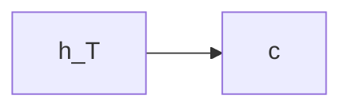
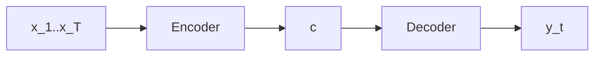
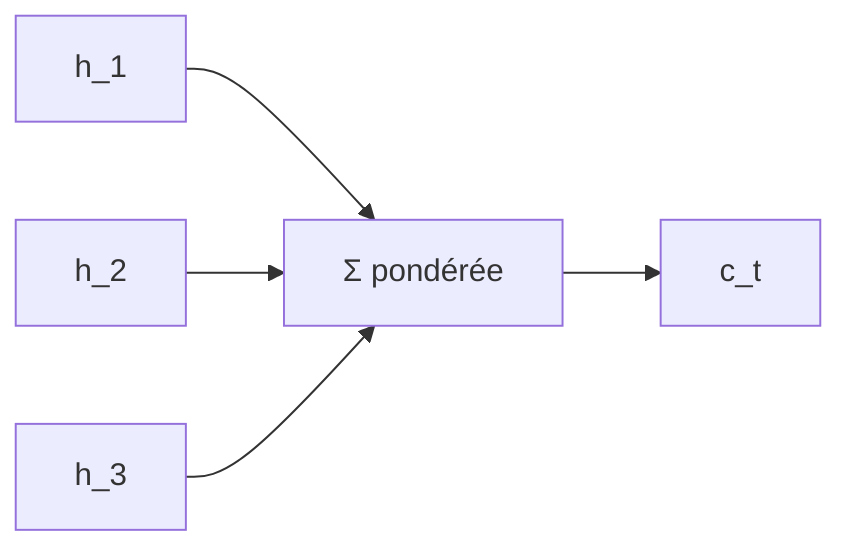

Voici la **version mise à jour et stabilisée du guide de rédaction**, intégrant **explicitement l’obligation de produire un diagramme Mermaid pour toute équation mathématique**, **sans aucun usage d’emoji**, et cohérente avec ton formalisme actuel.

---

# Guide de rédaction — Modèles séquentiels, attention et Transformers

## 1. Introduction des objets mathématiques

### Règle 1 — Première définition explicite

Lors de la **première introduction** d’un objet mathématique (séquence, variable, fonction) :

* utiliser une **définition explicite**
* ne pas utiliser `...`
* préférer une écriture développée avec indices

Exemple :

```markdown
On considère une séquence d’entrée :

[
(x_1, x_2, \dots, x_T)
]
```

`\dots` est autorisé pour les suites indexées.
Les points de suspension typographiques sont proscrits dans les définitions.

---

## 2. Séparation stricte : concept / équation

### Règle 2 — Toute équation doit être introduite

Aucune équation ne doit apparaître sans :

1. une phrase décrivant son **rôle fonctionnel**
2. un diagramme Mermaid illustrant son **flux de calcul**

Structure obligatoire :

1. phrase fonctionnelle
2. équation
3. diagramme Mermaid

---

## 3. Diagramme Mermaid obligatoire pour toute équation

### Règle 3 — Équation = schéma

Toute équation mathématique doit être accompagnée d’un **diagramme Mermaid correspondant**, même simple.

Exemples :

#### Équation de transition

```markdown
L’encodeur met à jour son état interne :

[
h_t = f_{\text{enc}}(x_t, h_{t-1})
]
```

Diagramme associé :

```mermaid
flowchart LR
    x_t[x_t] --> f[f_enc]
    h_prev[h_{t-1}] --> f
    f --> h_t[h_t]
```

---

#### Équation de contexte global

```markdown
Le contexte global est défini comme :

[
c = h_T
]
```

Diagramme associé :



---

4. Hiérarchie typographique
Règle 4 — Usage normé des styles

    Italique :

        définition d’un concept

        rôle fonctionnel

        notion introduite pour la première fois

    Texte courant :

        explication

        commentaire

        transition

    LaTeX :

        réservé exclusivement au formalisme mathématique

Conséquences rédactionnelles

    Une notion définie :

        est mise en italique à sa première occurrence

        revient ensuite en texte courant

    Aucun effet typographique ne doit concurrencer :

        les équations

        les schémas Mermaid
---

## 5. Structure canonique d’un mécanisme

### Règle 5 — Ordonnancement fixe

Toute section décrivant un mécanisme suit l’ordre :

1. schéma global (Mermaid)
2. définition des objets
3. équations locales + schémas
4. résumé fonctionnel
5. transition formelle

Aucun saut d’étape n’est autorisé.

---

## 6. Numérotation logique des sections

### Règle 6 — Numérotation fonctionnelle

Utiliser une numérotation explicite :

* `## 1. Encodeur`
* `## 2. Décodeur`
* `## 3. Résumé fonctionnel`

Même en Markdown, la numérotation est maintenue pour la clarté algorithmique.

---

## 7. Résumés fonctionnels encadrés

### Règle 7 — Synthèse obligatoire

Toute section majeure se termine par une forme fonctionnelle compacte :

```markdown
[
\boxed{
\begin{aligned}
c &= \mathrm{Encoder}(x_1, \dots, x_T) \\
y_t &= \mathrm{Decoder}(y_{<t}, c)
\end{aligned}
}
]
```

Diagramme associé :



---

## 8. Transitions formelles

### Règle 8 — Transition minimale

Toute transition vers un modèle plus général doit être exprimée par :

* une phrase
* une équation
* un diagramme

Exemple :

```markdown
Dans un modèle avec attention, le contexte devient dépendant de ( t ) :

[
c \;\longrightarrow\; c_t = \sum_j \alpha_{tj} h_j
]
```

Diagramme associé :



---

## 9. Terminologie stabilisée

### Règle 9 — Vocabulaire invariant

Les mêmes termes sont utilisés dans tout le cours :

| Concept             | Terme imposé                |
| ------------------- | --------------------------- |
| Hidden state        | état interne                |
| Context vector      | contexte                    |
| Attention weights   | poids d’attention           |
| Output distribution | distribution sur les tokens |

Les synonymes pédagogiques sont évités.

---

## 10. Règle d’or

> Le lecteur doit pouvoir reconstruire le modèle à partir :
>
> * des équations
> * des diagrammes Mermaid
> * des résumés fonctionnels

Le texte sert à orienter l’interprétation, pas à remplacer le formalisme.

---

Si tu le souhaites, je peux ensuite :

* appliquer ce guide à la **section attention complète**
* générer un **template Markdown normé**
* produire une **checklist de relecture automatique**
