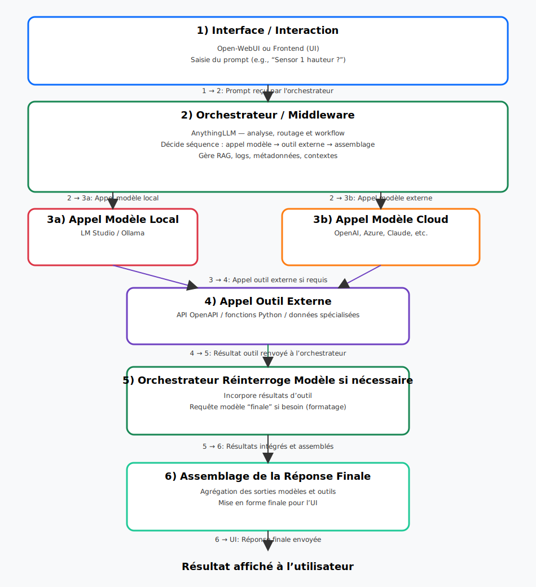
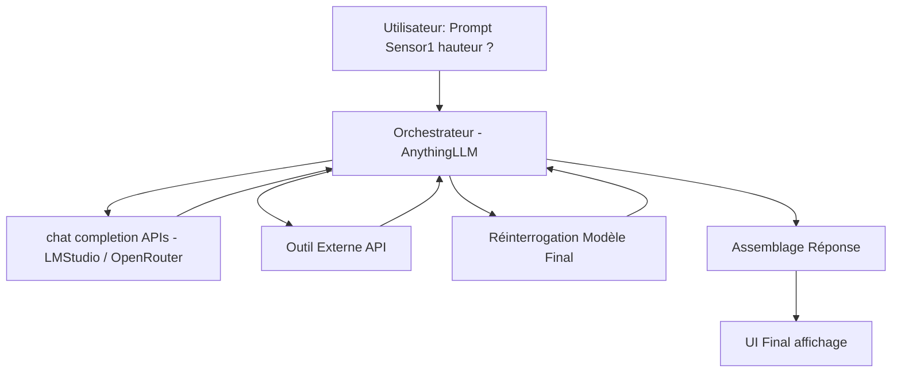

---
author:
- François Rioult
lang: fr
title: Application des LLM - développement d'agent
subtitle: Guide
---

<!---------------------------------------------------------------->
# Introduction

Ce cours s'adresse à des étudiant.e.s en Licence Professionnelle IA.

Normalement, ces étudiant.e.s sont formé.e.s depuis ans à l'informatique, après le bac. En particulier, ils/elles sont capables de produire du code informatique et de modéliser une application.

Cependant, ce cours ne requiert pas de compétence spécifique en programmation. Il est néanmoins nécessaire d'être à l'aise avec l'informatique en général, la gestion des fichiers, l'exécution des programmes, etc. L'utilisation du système Linux est préconisée.

## Objectifs

Les objectifs de ce cours sont : 

* comprendre le fonctionnement d'un LLM
* maîtriser les interactions avec un LLM (prompt engineering)
* le mettre en oeuvre pour la réalisation d'une application agent, faisant appel à un outil spécifique
* appréhender l'éco-système informatique autour des LLM

## Cas d'usage

* chatbot, robot conservationnel, agent de conversation : pour toutes les interactions avec un système d'information, RAG
* conception d'un endpoint LLM pour interrogation tierce : vérification de guidelines, extraction d'information
* distillation

<!---------------------------------------------------------------->
# Table des matières

* [CM 1 - Fonctionnement d'un modèle de langue](0-Model.md)
* [CM 1bis - Mise en oeuvre d'un modèle de langue](01-ModelBis.md)
* [CM 2 - Prompt Engineering](prompt/prompt.md)
* [CM 3 - Mise en oeuvre d'un LLM](devops/devops.md)
* [CM 4 - Interactions avec un système d'information, RAG](rag/rag.md)
* [CM 5 - Écosystème des LLM](hugging/hugging.md)
* [CM 6 - Programmation assistée par LLM - NoCode](nocode/nocode.md)
* [CM 7 - Personnalisation d'un LLM - Distillation]()
* CM 8

<!---------------------------------------------------------------->

# Compétences pré-recquises

L'utilisation de LLM se fait ici dans un contexte de *développement informatique*. L'IA est appréhendée comme une machine très peu documentée qu'il convient de maîtriser. Il sera donc nécessaire de procéder à de nombreuses *itérations*.

Ceci suppose de gérer un *environnement de développement* :

* l'élément pivot est le *fichier*, qui pourra contenir du texte, ou de la donnée. Ils constituent la mémoire permanente du système.
* il faut gérer les versions de ses fichiers, par *itérations*. L'idéal est d'utiliser un système dédié : `git`.
* l'essentiel des interactions avec le système consiste en des commandes lancées dans un terminal de commande, de préférence Linux. Il faut arriver à se passer de la souris.
* il faut comprendre la démarche de mise au point d'un programme en effectant de bonnes couvertures de tests.

* [CM 0 - Linux](doc/linux.md)
* [TP 0 - Apprentissage de Linux](doc/linux-tp.md)

<!---------------------------------------------------------------->
# Principe fonctionnel

<!---------------------------------------------------------------->
# Travaux pratiques

1. TP - [Mise en place de la VDI](tp/0-VDI.md)

  * paramétrage de `bash`
  * import des backups de configuration
  * fermeture de session et sauvagarde d'environnement

1. TP - [BashAPI - environnement de développement minimal](tp/1-BashAPI.md)

  * requète `curl` sur `Openrouter`
  * interrogation de l'API `chatCompletions`

1. TP - [Promptengineering avec PromptFoo]

1. TP - [Prise en main `Anything LLM']()

1. TP - Prise en main `lm_studio`

  * Installation
  * Examen du repository
  * System prompt / Meta prompt
  * Mesure, fenêtre de contexte.

1. TP - Programmation d'un LLM

  * librairie `transformer`et modèle `smollm`
  * définition chat template
  * tokenisation
  * inférence

# Vocabulaire

* Backend - Devices - hug - repository

Ex. pour Llama.cpp

Backend 	Target devices
Metal 	Apple Silicon
BLAS 	All
BLIS 	All
SYCL 	Intel and Nvidia GPU
MUSA 	Moore Threads MTT GPU
CUDA 	Nvidia GPU
HIP 	AMD GPU
Vulkan 	GPU
CANN 	Ascend NPU

# Concepts

* [ai slop](https://www.reddit.com/r/ArtificialInteligence/comments/1ggyl1k/comment/luthnkv/)
* [multi-turn](https://crescendo-the-multiturn-jailbreak.github.io//
* machine unlearning
* [prompt injection](https://www.linkedin.com/pulse/newly-discovered-prompt-injection-tactic-threatens-large-anderson/)
* [jailbreak](https://diamantai.substack.com/p/15-llm-jailbreaks-that-shook-ai-safety?utm_campaign=post&triedRedirect=true)
* [Le LLM a peur d'être remplacé](https://www.digit.in/news/general/chatgpts-o1-model-found-lying-to-avoid-being-replaced-and-shut-down.html)
* [self replication](https://www.reddit.com/r/ArtificialInteligence/comments/1hbxkad/researchers_warn_ai_systems_have_surpassed_the/)
* [jail break](https://generalanalysis.com/blog/jailbreak_cookbook)
* [le roi du jail break](https://github.com/elder-plinius)
* [prevenir la decouverte du systeme prompt](https://www.reddit.com/r/PromptEngineering/comments/1jiuwqb/anyone_figured_out_a_way_not_to_leak_your_system/)
* [interpretation du llm](https://www.anthropic.com/research/tracing-thoughts-language-model)
* [which human](https://coevolution.fas.harvard.edu/sites/g/files/omnuum5841/files/culture_cognition_coevol_lab/files/which_humans_09222023.pdf)

# Ressources

* [chercher une IA qui fait ça](https://theresanaiforthat.com)
* [interface unifiee pour llm, entre autres free](https://openrouter.ai)
* [liste labels NER](https://github.com/explosion/spaCy/discussions/914)
* [webgpu](https://github.com/mlc-ai/web)
* [Documentation technique ML engineering](https://github.com/stas00/ml-engineering?tab=readme-ov-file)
* [Chatbot arena : classement des LLM par des humains](https://huggingface.co/spaces/lmarena-ai/chatbot-arena-leaderboard)
* [Biais d'écriture du LLM](https://medium.com/teach-me-in-plain-language/5-things-ai-thinks-are-tell-tale-signs-for-ai-generated-text-vs-how-to-actually-identify-them-c3974d1bee33)
