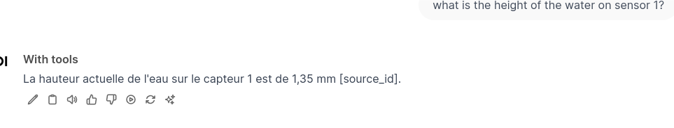

---
author:
- François Rioult
lang: en
title: Application of LLM
subtitle: Introduction
---

This document synthesizes my mishaps and successes in executing *tools* with `OWUI` (a.k.a [Open-webui](https://docs.openwebui.com/)).

# Introduction

`Open-webui` runs a local server and provides a web interface for designing LLM-based *applications*. It is a free and open-source tool developed by a single person, yet its quality is extraordinary:

* The prompt debugging interface is the most comprehensive I have seen: interactions are stored in a tree; it is a *tree-like history*.
* Everything necessary for RAG and model competition is integrated.
* *Filters* that modify both the prompt and the response.
* *Actions* that add functionalities to the prompt input interface: in addition to the traditional copy/vote, you can trigger code that interprets the model’s response, e.g., to generate graphs.
* *Tools* written in Python as well-documented functions are submitted along with the prompt to the model, which indicates which function to call and with what parameters.

An *application* created with `Open-webui` is thus a chatbot that queries and manipulates the responses of any model using code.

The promise is strong, but the implementation is challenging: `Open-webui` lacks the information needed to fully understand what is happening. Even though the documentation is detailed, the control aspects, particularly around logging, are rather inaccessible.

Below is an attempt to explain the execution of a custom tool.

# Understanding the Tool in the Context of `Open-webui`

## OpenAI API Tools

OpenAI has defined a query syntax for asking the model to choose a tool. An API query is constructed as follows:

* List of tools `tools.json`

```json
[
    {
        "type": "function",
        "function": {
            "name": "get_current_weather",
            "description": "Get the current weather, in particular the temperature, at a given location",
            "parameters": {
                "type": "object",
                "properties": {
                    "location": {
                        "type": "string",
                        "description": "The city and state, e.g. San Francisco, CA"
                    }
                },
                "required": [
                    "location"
                ]
            }
        }
    },
    ...
]
```

* Query assembly

```bash
MODEL='smollm2:1.7b'
tools=tools.json
messages='[{"role": "user", "content": "What is the temperature at the location 51.5074/-0.1278?"}]'

cmd="curl http://localhost:11434/v1/chat/completions \
  -H \"Content-Type: application/json\" \
  -d '{\"model\": \"$MODEL\", \"messages\": $messages, \"tools\": $(jq . $tools)}'"

echo $cmd >&2

eval $cmd
```

* The response is

```json
{
  "id": "chatcmpl-667",
  "object": "chat.completion",
  "created": 1736950622,
  "model": "smollm2:1.7b",
  "system_fingerprint": "fp_ollama",
  "choices": [
    {
      "index": 0,
      "message": {
        "role": "assistant",
        "content": "",
        "tool_calls": [
          {
            "id": "call_ivphnztl",
            "index": 0,
            "type": "function",
            "function": {
              "name": "get_current_weather",
              "arguments": "{\"location\":\"-0.1278,51.5074\",\"temperature\":12}"
            }
          },
          {
            "id": "call_qyx6dy9j",
            "index": 0,
            "type": "function",
            "function": {
              "name": "get_current_weather",
              "arguments": "{\"location\":\"-0.1278,51.5074\",\"temperature\":6}"
            }
          }
        ]
      },
      "finish_reason": "tool_calls"
    }
  ],
  "usage": {
    "prompt_tokens": 451,
    "completion_tokens": 91,
    "total_tokens": 542
  }
}
```

Even lightweight models handle this well.

## Tools in the Context of `Open-webui`

For `Open-webui`, using a tool involves two steps:

1. Querying the model to choose the tool to call.
2. Querying the model with the result of executing the Python function of the tool.

### Tool Selection

* The prompt:

        what is the height of the water on sensor 1?

* The list of tools and their descriptions:

```json
{
    "get_current_water_level": {
        "toolkit_id": "toolbox",
        "callable": <function Tools.get_current_water_level at 0x7fea0c082fc0>,
        "spec": {
            "name": "get_current_water_level",
            "description": "Get the current water level of a specific sensor.",
            "parameters": {
                "properties": {
                    "sensor_number": {
                        "description": "The sensor number of which should be used to measure the water level.",
                        "type": "string"
                    }
                },
                "required": [
                    "sensor_number"
                ],
                "type": "object"
            }
        },
        "pydantic_model": <class "open_webui.utils.tools.get_current_water_level">,
        "file_handler": False,
        "citation": True
    }
}
```

* And we ask:

        Return an empty string if no tools match the query. If a function tool matches, construct and return a JSON object in the format {"name": "functionName", "parameters": {"requiredFunctionParamKey": "requiredFunctionParamValue"}} using the appropriate tool and its parameters. Only return the object and limit the response to the JSON object without additional text.

* The model returns:

        DEBUG [open_webui.utils.middleware] content='{"name":"get_current_water_level","parameters":{"sensor_number":"1"}}'

### Response Formulation

The model is queried a second time with the result of the Python function, called with its parameter:

```python
    def get_current_water_level(self, sensor_number: str) -> str:
        """
        Get the current water level of a specific sensor.
        :param sensor_number: The sensor number of which should be used to measure the water level.
        :return: The current water level of the given sensor.
        """
        if sensor_number == "1":
            water_level = "1.35 mm"
        elif sensor_number == "2":
            water_level = "0.54 mm"
        else:
            water_level = "not applicable"

        return f"Answer in French that the current water level of sensor {sensor_number} is {water_level}."
```

The final response to the prompt is:

        Answer in French that the current water level of sensor 1 is 1.35 mm

which translates to:

        La hauteur actuelle de l'eau sur le capteur 1 est de 1,35 mm [source_id].


On this image, I got `[source_id]` en retour. No tool call button.


Sometimes I'm lucky and got a button, sometimes leadings to a pop-up with the function call result :


I was told that [to have the button](https://github.com/open-webui/open-webui/discussions/3134#discussioncomment-11218580), you need to declare:

```python
class Tools:
    def __init__(self):
        self.citation = True
```

# Discussion

To clearly identify the behavior of a tool, it's important to provide the model with:

* questions that only the tool can answer. The issue is that the model is very capable and can often have his own tools
* pre-prepared prompts with the result, which the model must format.

This means there are *two* steps to test!

And these questions are not straightforward from a prompt engineering perspective.

# Challenges

It is extremely difficult to establish a reliable development process with `Open-webui` because it is not always clear whether the tool has been triggered. Furthermore:

* the logs are sporadic in the web console,
* the logs are streamed both in stdout and stderr
* sometimes I get a button, and other times it provides a pop-up with the result of the Python function call.

# What I Recommend

* A robust model is needed to interpret the tool selection prompt. I use `gtp-4o-mini`. It's a bit of a luxury. Gemma-2B seemed promising.
* Start the server and store its standard output, which can then be analyzed and filtered:

```bash
open-webui serve | tee /tmp/log
```

And do whatever you like with it:

```bash
tail -f /tmp/log
```

# Prerequisites

## Model Selection

I haven't experimented much, but only `gpt-4o-mini` performs adequately.

I am working with the Python version, so the appropriate `conda` environment is required.

## Launching the Application

I have prepared a set of [logging variables](https://docs.openwebui.com/getting-started/advanced-topics/logging#appbackend).

```bash
$ cat config.sh
export AUDIO_LOG_LEVEL=INFO # Audio transcription using faster-whisper, TTS, etc.
export COMFYUI_LOG_LEVEL=DEBUG # ComfyUI integration handling
export CONFIG_LOG_LEVEL=DEBUG # Configuration handling
export DB_LOG_LEVEL=INFO # Internal Peewee Database
export IMAGES_LOG_LEVEL=INFO # AUTOMATIC1111 stable diffusion image generation
export MAIN_LOG_LEVEL=DEBUG # Main (root) execution
export MODELS_LOG_LEVEL=DEBUG # LLM model interaction, authentication, etc.
export OLLAMA_LOG_LEVEL=DEBUG # Ollama backend interaction
export OPENAI_LOG_LEVEL=DEBUG # OpenAI interaction
export RAG_LOG_LEVEL=INFO # Retrieval-Augmented Generation using Chroma/Sentence-Transformers
export WEBHOOK_LOG_LEVEL=INFO # Authentication webhook extended logging
```

Load this environment and launch the server:

```bash
source config.sh
open-webui serve | tee /tmp/log
```

Using the above sequence, I obtained the following logs in the console, which I will comment on:

```python
# user prompt
DEBUG [open_webui.utils.middleware] form_data: {'stream': True, 'model': 'with-tools', 'messages': [{'role': 'user', 'content': 'what is the height of the water on sensor 1?'}], 'tool_ids': ['toolbox'], 'features': {'web_search': False}, 'metadata': {'user_id': '2bcc63ca-ea49-461a-9c4b-e7930a2e2b99', 'chat_id': '0de06587-0cb2-4a1a-bda2-50f5d6a573e4', 'message_id': '22748f3d-c6d1-4eee-9ee5-7a2d0650233d', 'session_id': '9oCTk_-_vKFrLVa0AAAB', 'tool_ids': ['toolbox'], 'files': None, 'features': {'web_search': False}}}

# transformation prompt -> inlet par un filtre éventuel
INFO  [open_webui.utils.plugin] Loaded module: function_base
inlet called: {'stream': True, 'model': 'with-tools', 'messages': [{'role': 'user', 'content': 'what is the height of the water on sensor 1?'}], 'tool_ids': ['toolbox'], 'metadata': {'user_id': '2bcc63ca-ea49-461a-9c4b-e7930a2e2b99', 'chat_id': '0de06587-0cb2-4a1a-bda2-50f5d6a573e4', 'message_id': '22748f3d-c6d1-4eee-9ee5-7a2d0650233d', 'session_id': '9oCTk_-_vKFrLVa0AAAB', 'tool_ids': ['toolbox'], 'files': None, 'features': {'web_search': False}}}
DEBUG [open_webui.utils.middleware] tool_ids=['toolbox']
INFO  [open_webui.utils.plugin] Loaded module: tool_toolbox

# Définition des outils disponibles
INFO  [open_webui.utils.middleware] tools={..., 'get_current_water_level': {'toolkit_id': 'toolbox', 'callable': <function Tools.get_current_water_level at 0x7fea0c082fc0>, 'spec': {'name': 'get_current_water_level', 'description': 'Get the current water level of a specific sensor.', 'parameters': {'properties': {'sensor_number': {'description': 'The sensor number of which should be used to measure the water level.', 'type': 'string'}}, 'required': ['sensor_number'], 'type': 'object'}}, 'pydantic_model': <class 'open_webui.utils.tools.get_current_water_level'>, 'file_handler': False, 'citation': True}}

INFO  [open_webui.utils.middleware] 

# definition of prompt for selecting tool

tools_function_calling_prompt='Available Tools: [... {"name": "get_current_water_level", "description": "Get the current water level of a specific sensor.", "parameters": {"properties": {"sensor_number": {"description": "The sensor number of which should be used to measure the water level.", "type": "string"}}, "required": ["sensor_number"], "type": "object"}}]\nReturn an empty string if no tools match the query. If a function tool matches, construct and return a JSON object in the format {"name": "functionName", "parameters": {"requiredFunctionParamKey": "requiredFunctionParamValue"}} using the appropriate tool and its parameters. Only return the object and limit the response to the JSON object without additional text.'

# réponse du modèle
DEBUG [open_webui.utils.middleware] response={'id': 'chatcmpl-ApxUQa6si9pDCDDRYqwbr2FTj6oU4', 'object': 'chat.completion', 'created': 1736946770, 'model': 'gpt-4o-mini-2024-07-18', 'choices': [{'index': 0, 'message': {'role': 'assistant', 'content': '{"name":"get_current_water_level","parameters":{"sensor_number":"1"}}', 'refusal': None}, 'logprobs': None, 'finish_reason': 'stop'}], 'usage': {'prompt_tokens': 288, 'completion_tokens': 16, 'total_tokens': 304, 'prompt_tokens_details': {'cached_tokens': 0, 'audio_tokens': 0}, 'completion_tokens_details': {'reasoning_tokens': 0, 'audio_tokens': 0, 'accepted_prediction_tokens': 0, 'rejected_prediction_tokens': 0}}, 'service_tier': 'default', 'system_fingerprint': 'fp_72ed7ab54c'}

# réponse de chatgpt-4o 
DEBUG [open_webui.utils.middleware] content='{"name":"get_current_water_level","parameters":{"sensor_number":"1"}}'

# exécution de l'outil
DEBUG [open_webui.utils.middleware] tool_contexts: [{'source': {'name': 'TOOL:toolbox/get_current_water_level'}, 'document': ['Answer in french that the current water level of sensor 1 is 1.35 mm.'], 'metadata': [{'source': 'TOOL:toolbox/get_current_water_level'}]}]

# gtp-4o API call
INFO:     127.0.0.1:36306 - "POST /api/chat/completions HTTP/1.1" 200 OK
INFO:     127.0.0.1:36306 - "GET /api/v1/chats/?page=1 HTTP/1.1" 200 OK

# outlet definition
DEBUG [open_webui.routers.tasks] generating chat title using model with-tools for user francois.rioult@unicaen.fr 
outlet called: {'model': 'with-tools', 'messages': [{'id': '4a7fca32-ea06-4e4a-8582-b7b086e87dfb', 'role': 'user', 'content': 'what is the height of the water on sensor 1?', 'timestamp': 1736946769}, {'id': '22748f3d-c6d1-4eee-9ee5-7a2d0650233d', 'role': 'assistant', 'content': "La hauteur actuelle de l'eau sur le capteur 1 est de 1,35 mm [source_id].", 'timestamp': 1736946769, 'sources': [{'source': {'name': 'TOOL:toolbox/get_current_water_level'}, 'document': ['Answer in french that the current water level of sensor 1 is 1.35 mm.'], 'metadata': [{'source': 'TOOL:toolbox/get_current_water_level'}]}]}], 'chat_id': '0de06587-0cb2-4a1a-bda2-50f5d6a573e4', 'session_id': '9oCTk_-_vKFrLVa0AAAB', 'id': '22748f3d-c6d1-4eee-9ee5-7a2d0650233d'}

INFO:     127.0.0.1:36306 - "POST /api/chat/completed HTTP/1.1" 200 OK
INFO:     127.0.0.1:36306 - "POST /api/v1/chats/0de06587-0cb2-4a1a-bda2-50f5d6a573e4 HTTP/1.1" 200 OK
INFO:     127.0.0.1:36306 - "GET /api/v1/chats/?page=1 HTTP/1.1" 200 OK
DEBUG [open_webui.routers.tasks] generating chat tags using model with-tools for user francois.rioult@unicaen.fr 
INFO:     127.0.0.1:36306 - "GET /api/v1/chats/?page=1 HTTP/1.1" 200 OK
INFO:     127.0.0.1:36306 - "GET /api/v1/chats/0de06587-0cb2-4a1a-bda2-50f5d6a573e4 HTTP/1.1" 200 OK
INFO:     127.0.0.1:36306 - "GET /api/v1/chats/all/tags HTTP/1.1" 200 OK
```

## In the Browser Console

Some traces are available. Filtering with `sources`, you can see the function call response before it is processed by the model:

```json
{
  "sources": [
    {
      "source": {
        "name": "TOOL:toolbox/get_current_water_level"
      },
      "document": [
        "Answer in French that the current water level of sensor 1 is 1.35 mm."
      ],
      "metadata": [
        {
          "source": "TOOL:toolbox/get_current_water_level"
        }
      ]
    }
  ]
}
```

# Conclusion

## Lessons Learned

`Open-webui` holds the promise of competing with ChatGPT-plus Actions, which parse documentation, generate specifications, perform API calls, and return results. Both do not offer a rigorous development framework with source management and logging. However, at least with `Open-webui`, you can tinker!

Keep in mind that:

* The prompt is submitted to the model with the tool descriptions to select the correct one.
* The Python function call is executed according to the model's instructions.
* The result of the function call is processed by the model.

# Questions

* Is it possible to do better?
  * How can logs be generated within the tool?
  * Are logs stored somewhere? Analyzing the server output is impractical.
* Could the two LLM calls (tool selection and response generation) be decoupled?
* Could the initial tool selection call be forced using a standard API?

# Final Thought

I read yesterday that `Open-webui` is the [work of a single individual](https://www.reddit.com/r/OpenWebUI/comments/1gjziqm/im_the_sole_maintainer_of_open_webui_ama/). Respect!

Despite its diagnostic shortcomings, it works almost perfectly.

If it's the work of one person, perhaps one person can read the code and improve it?

# Sources

* [Code for water height on sensors](https://github.com/open-webui/open-webui/discussions/3134#discussioncomment-10796319)
* [Details on tools](https://github.com/open-webui/open-webui/discussions/3134#discussioncomment-11218580)
* [Details on function call capabilities](https://github.com/open-webui/open-webui/pull/6836)

```
("what is the first letter of the Latin alphabet",  "no tools needed"),
("what is the date today (use the get_current_time function)", "1 tool no args"),
("what is the value of sensor 1", "1 tool with args"),
("what are the values of sensors 1 and 4", "2 tools (they may be run in parallel if the API supports it)"),
("if the value of sensor 1 is less than 5 m/s, report the value of sensor 4. Otherwise, report sensor 3", "2 tools (in sequence if the model does it)"),
("choose an integer between 1 and 10, write it here. If it's greater than 5, report sensor 4. Otherwise, report sensor 1", "tool call after generating some text"),
("what is the value of sensor 'HELLO'",  "tool call raises an exception")
```
```

